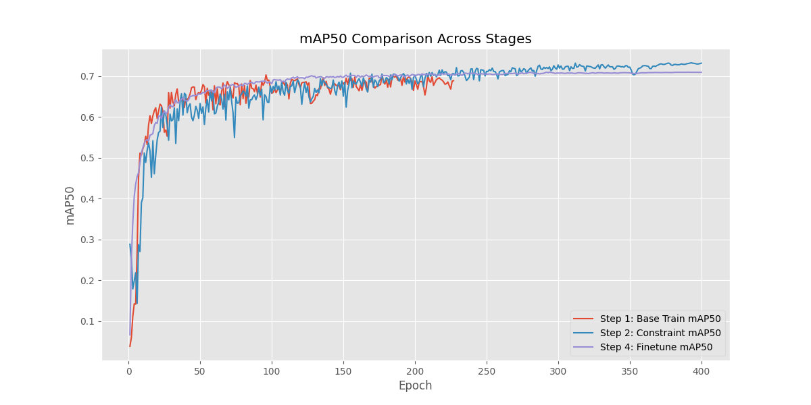

# AIC 国赛一等奖：基于视觉的果蔬成熟度智能分级

本项目面向果蔬成熟度智能分级任务，基于 YOLO 系列视觉检测模型识别果蔬成熟阶段，并围绕训练调参、模型剪枝、FP16 导出和推理接口封装完成工程化落地。

> 获奖情况：AIC 国赛一等奖  
> 个人职责：模型推理接口实现、模型参数调优、模型剪枝优化、训练流程与实验分析参与

## 项目亮点

- **小目标检测优化**：采用高分辨率训练与推理配置，提升密集果蔬目标识别效果。
- **类别不平衡处理**：通过 MixUp、Copy-Paste、分类损失权重调整等策略增强少数类识别能力。
- **轻量化部署**：基于 BN 稀疏约束与剪枝流程，尝试在精度、参数量和推理速度之间取得平衡。
- **推理接口封装**：实现竞赛平台标准接口，支持模型初始化、状态查询、图像推理和结构化结果输出。
- **推理性能优化**：结合 FP16、CUDA warmup、`PIL.Image.draft` 大图 I/O 优化，降低高分辨率图片推理开销。

## 仓库结构

```text
.
├── assets/                  # 可公开的实验曲线与结果摘要
├── configs/                 # 数据集配置模板
├── docs/                    # 训练、部署和 GitHub 发布说明
├── scripts/                 # 辅助脚本
├── src/
│   ├── inference.py         # 推理接口封装
│   ├── train.py             # 分阶段训练、剪枝、微调、蒸馏入口
│   └── utils/               # 剪枝与模型辅助模块
├── .gitignore
├── requirements.txt
└── README.md
```

## 技术路线

1. 数据预处理与 YOLO 格式划分；
2. YOLOv11 视觉检测模型训练；
3. 学习率、batch size、训练轮数、增强策略等参数调优；
4. 稀疏约束训练与模型剪枝；
5. 剪枝模型微调与蒸馏实验；
6. FP16 权重导出；
7. 平台推理接口封装与部署可用性评估。

## 快速开始

### 1. 安装依赖

```bash
pip install -r requirements.txt
```

如需复现实验，请准备 YOLOv11 权重、竞赛数据集和与训练时兼容的 `ultralytics` 版本或修改版源码。

### 2. 配置数据集

复制并修改数据集配置：

```bash
cp configs/sdses_ssp.example.yaml configs/sdses_ssp.yaml
```

将 `path` 改为本地数据集根目录，确保目录下包含 `train/`、`val/` 或对应的图片与标签路径。

### 3. 分阶段训练

```bash
python src/train.py --step 1 --yaml configs/sdses_ssp.yaml
python src/train.py --step 2 --yaml configs/sdses_ssp.yaml
python src/train.py --step 3 --yaml configs/sdses_ssp.yaml
python src/train.py --step 4 --yaml configs/sdses_ssp.yaml
python src/train.py --step 5 --yaml configs/sdses_ssp.yaml
```

其中 Step 2 需要开启 BN/L1 稀疏约束，Step 4 前需要关闭该约束。详细说明见 [docs/TRAINING.md](docs/TRAINING.md)。

### 4. 导出 FP16 权重

```bash
python scripts/convert_fp16.py \
  --input runs/nano/step3_pruning/weights/prune40.pt \
  --output runs/nano/prune40_fp16.pt
```

### 5. 推理接口调用

```python
from src.inference import init, get_status, process_image

init("runs/nano/prune40_fp16.pt")
print(get_status())
result = process_image("demo.jpg")
print(result)
```

输出格式包含 `objects`、`classifications`、`segmentations` 三类结果，适配竞赛平台接口。

## 实验结果

项目保留了部分可公开实验曲线：



更多图表见 `assets/plots/`。完整训练权重、原始数据集、平台材料和非公开答辩文件未纳入 GitHub 仓库。

## 个人工作

- 实现训练后模型的标准推理接口，完成图像输入、模型加载、前向推理和结果结构化输出。
- 围绕学习率、batch size、训练轮数、数据增强和损失权重进行多轮调参。
- 参与模型剪枝实验，关注精度、参数量和推理速度之间的平衡。
- 参与训练流程设计、实验结果整理和部署可用性评估。

## 说明

- 本仓库为比赛项目整理版，不包含完整竞赛数据集、私有权重、发票、答辩源文件和平台压缩包。
- 若需要上传权重，建议使用 GitHub Releases 或 Git LFS，不建议直接提交 `.pt`、`.pth`、`.onnx` 等大文件。
- 数据集和赛题材料请以官方授权渠道为准。
